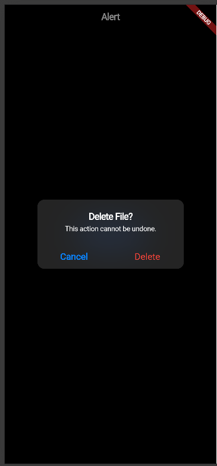

# cupertino_widget

A simple Flutter app that demonstrates a Cupertino alert dialog for confirming a destructive action.

## What It Demonstrates

This app shows how to use `CupertinoAlertDialog` in a real-world situation, such as confirming a file delete action.

## Run Instructions

1. Make sure Flutter is installed.
2. Open the project in VS Code or Android Studio.
3. Run:

	flutter pub get
	flutter run

## Three Widget Attributes

This demo focuses on exactly three `CupertinoAlertDialog` attributes:

- `title`: Displays the alert heading, such as `Delete File?`
- `content`: Shows the warning message, such as `This action cannot be undone.`
- `actions`: Defines the buttons shown in the dialog, such as `Cancel` and `Delete`

## Screenshots

The README now shows both images from the app demo:

## Presentation Comment

<!-- In-class presentation date: 2026-06-29 -->
